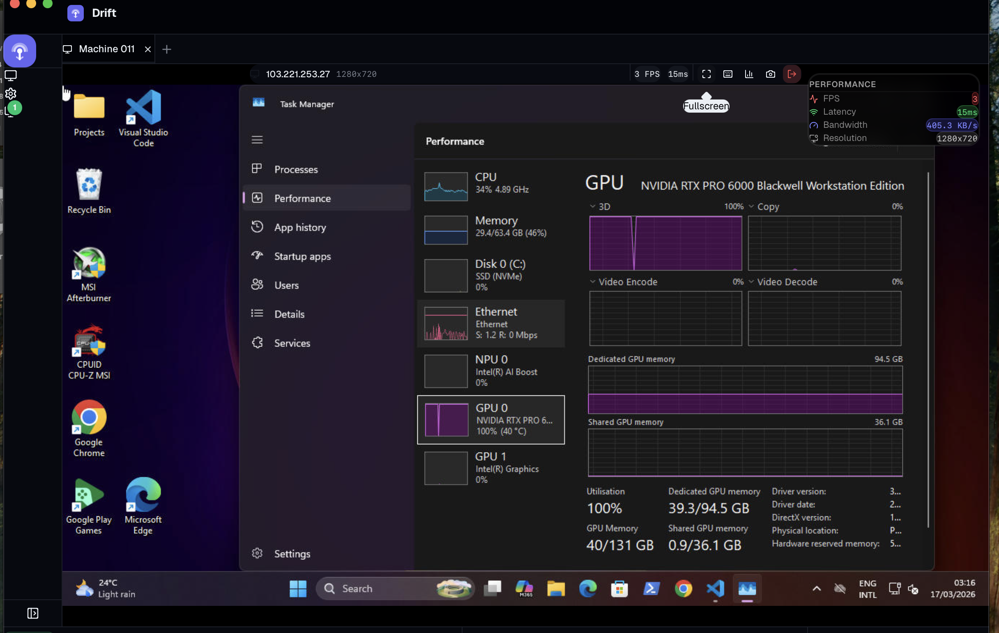

<p align="center">
  
</p>

<h1 align="center">Drift</h1>

<p align="center">
  <strong>A fast, beautiful remote desktop client for macOS & Linux.</strong>
  <br />
  Built with Rust, Tauri, React, and IronRDP.
</p>

<p align="center">
  <a href="#features">Features</a> &middot;
  <a href="#install">Install</a> &middot;
  <a href="#building-from-source">Build</a> &middot;
  <a href="#architecture">Architecture</a> &middot;
  <a href="#roadmap">Roadmap</a>
</p>

<br />

<p align="center">
  
</p>

<br />

## Why Drift?

Most RDP clients on macOS are either slow, ugly, or abandoned. Drift is none of those.

- **Native performance** &mdash; GPU-rendered frames via wgpu (Metal/Vulkan). No Electron, no browser overhead.
- **Real RDP protocol** &mdash; Full IronRDP implementation with TLS + CredSSP/NLA authentication.
- **Beautiful UI** &mdash; Custom-designed interface with shadcn/ui, glassmorphism, and smooth animations.
- **Tiny footprint** &mdash; ~15MB binary. Ships as a single `.app` or `.AppImage`.

## Features

**Remote Desktop**
- Connect to Windows machines via RDP (port 3389)
- Full TLS encryption + NLA/CredSSP authentication
- Keyboard, mouse, and trackpad scroll forwarding
- Multi-session support with tabbed interface (up to 10 simultaneous)
- Auto-reconnect with exponential backoff on connection loss
- Configurable resolution, color depth, and quality

**GPU Rendering Pipeline**
- wgpu-powered frame rendering (Metal on macOS, Vulkan on Linux)
- Zero-copy double-buffer SharedFrame architecture
- Condvar-based frame signaling (0% CPU when idle)
- H.264 hardware encoder ready for session recording
- Fallback to software Canvas rendering when GPU unavailable

**Interface**
- Quick Connect via `Cmd+K` &mdash; search and connect in seconds
- Connection cards with color accents, tags, and latency indicators
- Real-time performance HUD (FPS, latency, bandwidth, resolution)
- Settings page with theme, display, and network configuration
- Keyboard shortcut overlay (`Cmd+?`)
- Dark and light themes
- SSH config import (`~/.ssh/config`)

**Security**
- Passwords stored in the OS keychain (macOS Keychain / Linux Secret Service)
- No plaintext credential storage
- Connection configs persisted as local JSON (no cloud, no telemetry)

## Install

### macOS

```bash
# Download the latest .dmg from Releases
# Or build from source (see below)
```

### Linux

```bash
# Download the latest .AppImage or .deb from Releases
# Or build from source (see below)
```

> **Note:** Drift is in active development. Pre-built binaries will be available once v0.2.0 ships.

## Building from Source

### Prerequisites

- [Rust](https://rustup.rs/) (1.77+)
- [Node.js](https://nodejs.org/) (20+)
- [Tauri CLI](https://v2.tauri.app/start/prerequisites/)

**macOS additional:**
```bash
xcode-select --install
```

**Linux additional:**
```bash
sudo apt install libwebkit2gtk-4.1-dev libappindicator3-dev librsvg2-dev patchelf
```

### Build & Run

```bash
git clone https://github.com/CREVIOS/drift-rdp.git
cd drift-rdp
npm install
cargo tauri dev        # Development (hot-reload)
cargo tauri build      # Production binary
```

## Architecture

```
                    Drift Architecture
    ================================================

    ┌─────────── Tauri Window ───────────────────┐
    │                                             │
    │  ┌─── wgpu Surface (Metal/Vulkan) ───────┐ │
    │  │  GpuRenderer                           │ │
    │  │  ├── SharedFrame.publish() [zero-copy] │ │
    │  │  ├── queue.write_texture() [DMA]       │ │
    │  │  └── render_pass → present             │ │
    │  └────────────────────────────────────────┘ │
    │                                             │
    │  ┌─── WebView (React + shadcn/ui) ───────┐ │
    │  │  Toolbar, Sidebar, Tabs, Settings      │ │
    │  │  (transparent overlay for UI only)     │ │
    │  └────────────────────────────────────────┘ │
    └─────────────────────────────────────────────┘
                        │
              Tauri IPC (input events)
                        │
    ┌─────────── Rust Backend ────────────────────┐
    │                                              │
    │  SessionManager                              │
    │  ├── SessionActor (1 per connection)         │
    │  │   ├── IronRDP ActiveStage                 │
    │  │   ├── TLS + CredSSP/NLA                   │
    │  │   ├── SharedFrame.update_rect()           │
    │  │   └── Input forwarding (kbd/mouse/scroll) │
    │  │                                           │
    │  ├── ConnectionStore (JSON persistence)      │
    │  ├── CredentialStore (OS keychain)           │
    │  └── SettingsStore                           │
    └──────────────────────────────────────────────┘
```

### Frame Pipeline

```
IronRDP GraphicsUpdate (dirty rects)
    │
    ▼
SharedFrame.begin_write()          ← 1 mutex lock for all rects
    ├── update_rect() × N          ← memcpy, ~0.3ms
    └── mark_dirty()               ← condvar wakes render thread
    │
    ▼
GpuRenderer (dedicated OS thread)
    ├── wait_for_frame()           ← sleeps until signaled (0% CPU idle)
    ├── publish()                  ← zero-copy buffer swap
    ├── write_texture()            ← DMA upload to GPU, ~1ms
    ├── render_pass()              ← fullscreen quad shader
    └── present()                  ← Metal/Vulkan display
```

### Tech Stack

| Layer | Technology |
|-------|-----------|
| Protocol | [IronRDP](https://github.com/Devolutions/IronRDP) (Rust RDP implementation) |
| Runtime | [Tauri v2](https://v2.tauri.app/) (Rust + WebView) |
| GPU | [wgpu](https://wgpu.rs/) (Metal / Vulkan / DX12) |
| Frontend | React 19 + TypeScript + [shadcn/ui](https://ui.shadcn.com/) |
| Styling | Tailwind CSS v4 |
| TLS | rustls + webpki |
| Auth | CredSSP / NLA via IronRDP |
| Credentials | [keyring](https://crates.io/crates/keyring) (OS keychain) |
| Video | [openh264](https://crates.io/crates/openh264) (H.264 encoder) |

## Roadmap

- [x] Full IronRDP connection (TLS + CredSSP/NLA)
- [x] GPU-rendered frames via wgpu
- [x] Keyboard + mouse + trackpad scroll input
- [x] Multi-session tabs
- [x] Auto-reconnect with backoff
- [x] H.264 encoder (for future session recording)
- [x] Dark/light theme + shadcn/ui
- [x] Quick Connect (`Cmd+K`)
- [x] SSH config import
- [ ] Clipboard sync (bidirectional text + images)
- [ ] Audio redirection
- [ ] File transfer via drag-and-drop
- [ ] Multi-monitor support
- [ ] Session recording (H.264 → MP4)
- [ ] SSH tunneling for RDP-over-SSH
- [ ] Auto-discovery of Windows machines on LAN

## Project Structure

```
drift-rdp/
├── src/                      # React frontend
│   ├── components/           # UI components (shadcn/ui)
│   │   ├── connections/      # Connection cards, forms
│   │   ├── session/          # Canvas, toolbar, tabs, HUD
│   │   ├── settings/         # Settings page
│   │   ├── layout/           # Sidebar, status bar
│   │   └── ui/               # shadcn primitives
│   ├── hooks/                # useRdpSession, useTheme, etc.
│   ├── stores/               # Zustand stores
│   ├── lib/                  # Input mapper, frame protocol, H.264 decoder
│   └── styles/               # Tailwind + theme
├── src-tauri/                # Rust backend
│   └── src/
│       ├── rdp/              # IronRDP session actor, client, input
│       ├── renderer/         # wgpu GPU renderer, SharedFrame, H.264 encoder
│       ├── commands/         # Tauri IPC commands
│       ├── store/            # Persistence (connections, settings, keychain)
│       └── utils/            # TCP probe, latency measurement
└── .github/                  # CI/CD, assets
```

## Contributing

Contributions are welcome! Please open an issue first to discuss what you'd like to change.

```bash
# Run in development
cargo tauri dev

# Type-check
npx tsc --noEmit
cargo check

# Build for production
cargo tauri build
```

## License

MIT

---

<p align="center">
  <sub>Built with Rust, shipped with love.</sub>
</p>
